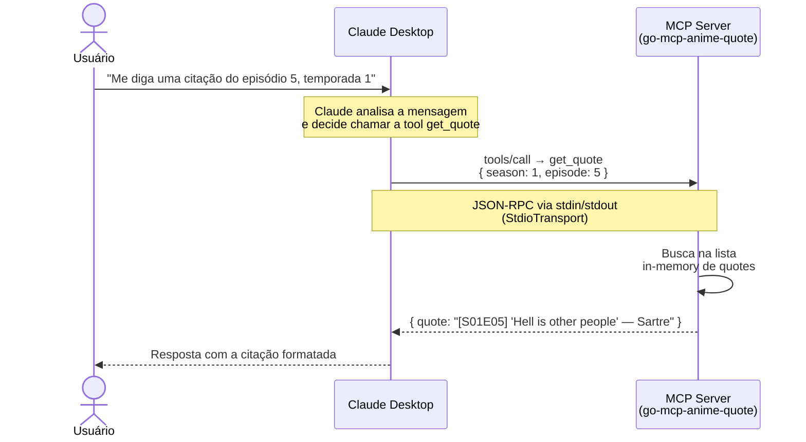

# go-mcp-anime-quote

Um servidor MCP (Bem simples) escrito em Go que expõe frases filosóficas do anime **Classroom of the Elite** como uma tool para LLMs.

Compatível com Claude Desktop, Cursor, Windsurf e qualquer cliente que suporte o Model Context Protocol.

## Pré-requisitos

- [Docker](https://www.docker.com/products/docker-desktop) — para buildar e rodar o servidor
- [Claude Desktop](https://claude.ai/download) — para testar a integração

> Não é necessário ter Go instalado na sua máquina.

## Buildando com Docker

### 1. Clone o repositório

```bash
git clone https://github.com/subipranuvem/youtube-video-assets.git
cd go-mcp-anime-quote
```

### 2. Build da imagem

```bash
docker build -t go-mcp-anime-quote .
```

### 3. Extraia o binário para sua máquina

O Claude Desktop precisa executar um binário local — ele não consegue se comunicar com um container diretamente via `StdioTransport`. Por isso, copiamos o binário compilado para fora do container:

```bash
docker run --rm \
  -v $(pwd):/output \
  go-mcp-anime-quote \
  cp /app/go-mcp-anime-quote /output/go-mcp-anime-quote
```

O binário estará disponível em `./go-mcp-anime-quote`.

> **Nota:** o container não consegue executar o binário (ele é macOS rodando em Linux), mas a extração funciona perfeitamente.

Por padrão, o build gera um binário para **macOS Apple Silicon (arm64)**. Se precisar de outra plataforma, passe os build args:

```bash
# Intel Mac (amd64)
docker build --build-arg GOARCH=amd64 -t go-mcp-anime-quote .

# Linux amd64
docker build --build-arg GOOS=linux --build-arg GOARCH=amd64 -t go-mcp-anime-quote .
```

## Configurando o Claude Desktop

Abra o arquivo de configuração do Claude Desktop:

- **macOS:** `~/Library/Application Support/Claude/claude_desktop_config.json`
- **Windows:** `%APPDATA%\Claude\claude_desktop_config.json`

Adicione o bloco `mcpServers` apontando para o binário extraído:

```json
{
  "mcpServers": {
    "anime-quote": {
      "command": "/caminho-absoluto-para-o-repo/go-mcp-anime-quote"
    }
  }
}
```
Use o caminho absoluto. Caminhos relativos não funcionam aqui.

Para descobrir o caminho absoluto, execute o comando `pwd` dentro da pasta do projeto:

```bash
cd go-mcp-anime-quote
pwd
# exemplo: /Users/seu-usuario/projetos/go-mcp-anime-quote
```

O valor do `command` será esse caminho seguido de `/go-mcp-anime-quote`.

Salve o arquivo e **reinicie o Claude Desktop**. O servidor só é carregado na inicialização.

## Como funciona



## Testando

Com o Claude Desktop aberto, tente:

> *"Me diga uma citação do episódio 5 da temporada 1 de Classroom of the Elite."*

O Claude vai identificar automaticamente que precisa chamar a tool `get_quote` e retornar a frase correta.

## Licença

MIT